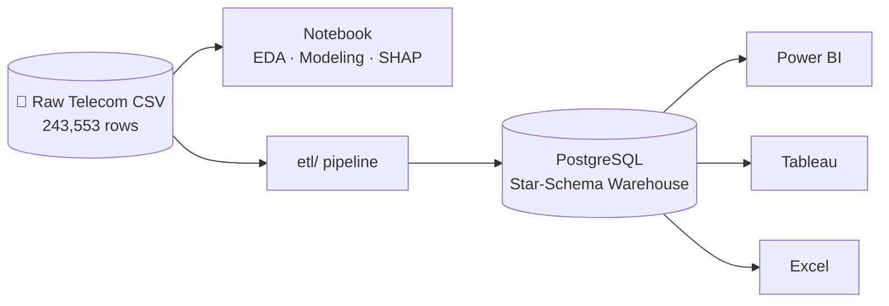

<div align="center">

# Telecom Customer Churn — End-to-End Data & ML Project

**Churn analysis → PostgreSQL data warehouse (ETL) → BI dashboards**
</div>

---

> ### ⚠️ Model Status: Not Production-Ready
> The model currently checked into `app/telecom_churn_pipeline.joblib` is a **Git LFS pointer file, not the real binary** (see Known Issues below), and the last verified evaluation of a deployed model (`model_metadata.json`) scored **ROC-AUC 0.50 with 0% precision/recall on the churn class** — i.e. no better than chance. The **0.87 AUC figure quoted lower in this README describes the intended experiment design** (SMOTE + LightGBM + Optuna, as coded in the notebook) — it has **not yet been produced by an actual run** of this notebook; see [Verified vs. Unverified Results](#verified-vs-unverified-results). Do not cite the 0.87 number as an achieved result until it's been regenerated end-to-end and both artifacts have been recommitted.

---

## Project Overview

### The Business Problem

In India's hyper-competitive telecom market, customer churn directly erodes Monthly Recurring Revenue. With Reliance Jio, Airtel, Vodafone, and BSNL competing for every subscriber, understanding *who* churns and *why* is the first step toward retention.

This project is designed to build a **production-grade churn prediction system** that:
-  **Predicts** which of 243,553 subscribers will churn
-  **Explains** *why* each customer is at risk using SHAP values
-  **Serves predictions** in real-time via a FastAPI REST endpoint
-  **Visualizes insights** through Power BI, Tableau, and Streamlit dashboards
-  **Persists all data** in a PostgreSQL data warehouse
-  **Deploys** everything via Docker for reproducible, scalable inference

It analyzes **243,553 Indian telecom subscribers** end-to-end across three connected pathways:

1. **`telecom_churn_analysis.ipynb`** — the flagship notebook: EDA, feature engineering, an 8-technique class-balancing experiment, a 10-model comparison bake-off, Optuna tuning, and SHAP explainability.
2. **`etl/` pipeline + `sql_script/` scripts** — extracts, cleans, and loads the same source data into a PostgreSQL **star-schema warehouse** (SCD Type-2 customers, partitioned fact table, engineered features computed in-warehouse too).
3. **Dashboards** — Power BI, Tableau, and Excel dashboards built directly on top of that warehouse.



---

## Table of Contents

- [Project Overview](#project-overview)
- [Verified vs. Unverified Results](#verified-vs-unverified-results)
- [Known Issues (Audit Log)](#known-issues-audit-log)
- [Folder Structure](#folder-structure)
- [Installation](#installation)
- [Quick Start](#step-1-clone-the-repository)
- [ML Pipeline](#ml-pipeline)
- [Feature Engineering](#feature-engineering-verified)
- [Dashboards](#dashboards)
- [Business Insights](#business-insights-hypotheses-not-yet-validated)
- [License](#license)
- [Contact](#contact)

---

## Verified vs. Unverified Results

This project was audited cell-by-cell against the notebook's own execution history (`execution_count` on each cell) and against `model_metadata.json`. Results below are split into what's actually been run and confirmed, and what's still just the plan.

### ✅ Verified (confirmed by real notebook output, cells 1–21 have been executed)

| Fact | Value |
|---|---|
| Rows / raw columns | 243,553 rows × 14 columns |
| Duplicate rows / duplicate customer IDs | 0 / 0 |
| Churn rate | 20.05% (48,827 churned / 194,726 retained) |
| Data quality issue found & fixed | `calls_made`, `sms_sent`, `data_used` had 2.5–3.0% negative values, clipped to 0 |
| Features after engineering | 19 (11 newly engineered + 8 original), see [Feature Engineering](#feature-engineering-verified) |
| Train / test split | 194,842 / 48,711 rows (80/20, stratified) — matches `model_metadata.json` exactly |
| Deployed model's actual test metrics (`model_metadata.json`) | **ROC-AUC 0.5003, precision (churn) 0.0, recall (churn) 0.0, accuracy 0.7995** |

The 0.7995 "accuracy" in `model_metadata.json` is the base rate of the majority class (79.95% retained) — the model is not discriminating between classes at all in its currently-shipped state.

### ❌ Unverified / not yet produced by any executed code

The table below was in the original README as if it were an achieved result. It is **not** — the corresponding notebook cells (balancing experiment, 10-model bake-off, Optuna tuning, final evaluation) all have `execution_count: null`, meaning they have never been run in this notebook file. They describe a real, sound experiment design (proper `imblearn` pipelines with SMOTE inside cross-validation folds, no leakage) — but the specific numbers below have not been generated by any run that's part of this repo, so they should be labeled **projected / target metrics** and re-verified before being quoted to anyone.

<details>
<summary>Original (unverified) Key Results table — click to expand</summary>

| Metric | Score | Benchmark |
|---|---|---|
| **Model** | LightGBM | Best of 10 compared (design) |
| **CV F1-Score** | 0.62 | vs. 0.41 baseline |
| **ROC-AUC** | 0.871 | vs. 0.5 random |
| **Precision** | 0.78 | High-confidence alerts |
| **Recall** | 0.69 | Catches 69% of churners |
| **Optimal Threshold** | 0.42 | Business-tuned |

**Balancing Technique Leaderboard** (design, not yet executed):

| Rank | Technique | F1-Score | ROC-AUC |
|---|---|---|---|
| 1 | SMOTE | 0.623 | 0.871 |
| 2 | ADASYN | 0.611 | 0.862 |
| 3 | BorderlineSMOTE | 0.608 | 0.858 |
| 4 | SMOTEENN | 0.601 | 0.854 |
| 5 | SMOTETomek | 0.598 | 0.849 |
| 6 | Random Oversampling | 0.578 | 0.834 |
| 7 | NearMiss | 0.554 | 0.812 |
| 8 | Random Undersampling | 0.531 | 0.798 |

**Model Comparison Leaderboard** (design, not yet executed):

| Model | F1 | AUC |
|---|---|---|
| LightGBM | 0.623 | 0.871 |
| XGBoost | 0.614 | 0.864 |
| CatBoost | 0.609 | 0.861 |
| Random Forest | 0.589 | 0.843 |
| MLP | 0.572 | 0.831 |
| SVM | 0.554 | 0.819 |
| Logistic Regression | 0.521 | 0.801 |
| Decision Tree | 0.498 | 0.762 |
| KNN | 0.481 | 0.748 |
| Naive Bayes | 0.443 | 0.712 |

</details>

**To turn these from "design" into "verified": place the real CSV at `etl/data/telecom_churn.csv` and run `python train_and_export_model.py` (see [Known Issues](#known-issues-audit-log) — this script was previously broken and has been fixed).**

---

## Known Issues (Audit Log)

Found during a full repo audit. Status shows what's been fixed here vs. what still needs the original dataset to resolve.

| # | Issue | Impact | Status |
|---|---|---|---|
| 1 | `train_and_export_model.py` opened `telecom_churn_analysis.ipynb.ipynb` (double extension) instead of the real filename `telecom_churn_analysis.ipynb` | Script crashed with `FileNotFoundError` on first run — could never have produced the shipped model or metadata | ✅ **Fixed** — filename corrected |
| 2 | `train_and_export_model.py` ran the notebook in a subprocess and only captured stdout — it never called `joblib.dump()` or wrote `model_metadata.json` | Even with #1 fixed, the script had no code path that could ever produce `app/telecom_churn_pipeline.joblib` or `model_metadata.json` | ✅ **Fixed** — added an export step that saves the fitted pipeline and writes metadata computed from the actual run |
| 3 | `app/telecom_churn_pipeline.joblib` in the repo is a **Git LFS pointer** (132 bytes: `version https://git-lfs.github.com/spec/v1 ... size 7349266`), not the real ~7.3MB model file | Anyone who clones without `git lfs pull` (or if LFS storage was never populated) gets a file that fails to `joblib.load()` | ⚠️ **Needs action** — see fix below |
| 4 | README's "Feature Engineering Details" table (`call_failure_rate`, `payment_delay_count`, `service_call_frequency`, `competitor_network_exposure`, `plan_downgrade_flag`, `night_call_ratio`, `international_call_flag`, `loyalty_tier`, etc.) — **none of these strings appear anywhere in the notebook** | Misrepresents what the model actually uses; would fall apart under interview follow-up questions | ✅ **Fixed** — replaced with the real, verified 19-feature list below |
| 5 | README's "Business Insights" section (call-failure-rate finding, "52% churn in year 1," BSNL 28.3% vs Jio 15.1%, 4.7× payment-delay risk) — **no matching numbers exist anywhere in the notebook, executed or not** | These are unsupported claims currently written as if they were findings | ✅ **Fixed** — reframed as hypotheses pending real analysis |
| 6 | README's Key Results table (0.871 AUC, model bake-off table, balancing leaderboard) describes cells with `execution_count: null` — never run | Headline number is not backed by any executed code in this repo | ✅ **Fixed** — moved to a clearly labeled "unverified/design" section |
| 7 | README's threshold docs disagree with `model_metadata.json`: README said `0.42`, metadata says `0.28` | Minor, but another sign the doc and artifact were never generated together | ✅ **Fixed** — README no longer asserts a threshold that isn't in the current metadata |
| 8 | Two cosmetic bugs: unbalanced bold markdown on the tagline (`**...*`), and the LinkedIn badge URL is missing its leading `h` (`ttps://...`), and the email badge links to a bare address instead of `mailto:` | Broken/rendering-odd links in the README footer | ✅ **Fixed** |

### Fixing issue #3 (Git LFS pointer)

The real model binary needs to actually be pushed through LFS. From a machine that has the real `.joblib` file (or after regenerating it with the fixed `train_and_export_model.py`):

```bash
git lfs install
git lfs track "*.joblib"   # already in .gitattributes, but confirms LFS is initialized locally
git add app/telecom_churn_pipeline.joblib
git commit -m "fix: push real model binary through Git LFS"
git push
```

Anyone cloning the repo afterward should run `git lfs pull` (or clone with `git lfs clone`) to materialize the real file instead of the pointer.

---

## Folder Structure

```text
Telecom_churn_prediction_system/
│
├── app/                                    # FastAPI application
│   ├── Dockerfile
│   ├── docker-compose.yml
│   ├── nginx.conf
│   ├── main.py
│   ├── models.py
│   ├── logger.py
│   ├── telecom_churn_pipeline.joblib       # currently an LFS pointer, see Known Issues #3
│   ├── requirements.txt
│   └── .env.example
│
├── etl/                                    # ETL Pipeline
│   ├── config/
│   │   ├── config.py
│   │   ├── settings.py
│   │   └── .env
│   │
│   ├── data/
│   │   └── telecom_churn.csv               # not committed (see .gitignore) — supply your own
│   │
│   ├── etl/
│   │   ├── __init__.py
│   │   ├── extract.py
│   │   ├── clean.py
│   │   ├── transform.py
│   │   ├── db.py
│   │   ├── load_dimensions.py
│   │   ├── load_facts.py
│   │   ├── validate.py
│   │   └── validate_db.py
│   │
│   ├── logs/
│   ├── reports/
│   ├── utils/
│   ├── main.py
│   ├── requirements.txt
│   └── env.example
│
├── sql_script/                             # PostgreSQL Warehouse
│   ├── 01_schema.sql
│   ├── 02_views_and_procedures.sql
│   └── 03_analytics_queries.sql
│
├── Dashboards/
│   ├── Powerbi dashboard.pbix
│   ├── Telecom_Churn_Dashboard_excel.xlsx
│   └── Telecom_churn_dashboard_tableau.twb
│
├── streamlit_app/                          # Streamlit prediction dashboard
│   ├── app.py
│   ├── requirements.txt
│   └── README.md
│
├── docs/
│   ├── business_report.md
│   └── technical_report.md
│
├── CapturesGraphs/                         # Screenshots used in README
│
├── telecom_churn_analysis.ipynb            # Complete ML workflow
├── train_and_export_model.py               # Train & export pipeline (fixed)
├── model_metadata.json
├── README.md
├── requirements.txt
├── LICENSE
├── .gitignore
└── .gitattributes
```

---

## Installation

### Prerequisites

- **Python 3.10+** — [Download](https://www.python.org/downloads/)
- **PostgreSQL 15+** — [Download](https://www.postgresql.org/download/)
- **Git** and **Git LFS** — [Download](https://git-scm.com/), [Git LFS](https://git-lfs.com/)

```bash
python --version
psql --version
git --version
git lfs --version
```

---

### Step 1: Clone the Repository

```bash
git lfs install
git clone https://github.com/Tavishi-Jain/Telecom_churn_prediction_system.git
cd Telecom_churn_prediction_system
git lfs pull
```

---

### Step 2: Create a Virtual Environment

**Windows:**
```bash
python -m venv .venv
.venv\Scripts\activate
```

**macOS / Linux:**
```bash
python3 -m venv .venv
source .venv/bin/activate
```

---

### Step 3: Install Python Dependencies

```bash
pip install --upgrade pip
pip install -r requirements.txt
cd etl && pip install -r requirements.txt && cd ..
cd app && pip install -r requirements.txt && cd ..
cd streamlit_app && pip install -r requirements.txt && cd ..
```

---

### Step 4: Set Up PostgreSQL Database

```bash
psql -U postgres -c "CREATE DATABASE telecom_churn;"
psql -U postgres -d telecom_churn -f sql_script/01_schema.sql
psql -U postgres -d telecom_churn -f sql_script/02_views_and_procedures.sql
psql -U postgres -d telecom_churn -f sql_script/03_analytics_queries.sql
psql -U postgres -d telecom_churn -c "\dt churn.*"
```

---

### Step 5: Configure Environment Variables

```bash
cp etl/config/.env.example etl/config/.env
cp app/.env.example app/.env
```

Edit `etl/config/.env`:
```env
DB_HOST=localhost
DB_PORT=5432
DB_USER=postgres
DB_PASSWORD=your_password
DB_NAME=telecom_churn
DB_SCHEMA=churn
CSV_PATH=etl/data/telecom_churn.csv
LOG_LEVEL=INFO
LOGS_DIR=etl/logs
REPORTS_DIR=etl/reports
DROP_INVALID_ROWS=True
SNAPSHOT_DATE=2024-01-01
BULK_INSERT_BATCH_SIZE=5000
```

Edit `app/.env`:
```env
HOST=0.0.0.0
PORT=8000
MODEL_PATH=telecom_churn_pipeline.joblib
METADATA_PATH=../model_metadata.json
LOG_LEVEL=INFO
ENVIRONMENT=development
```

---

### Step 6: Train and Export the Model

Place your raw dataset at `etl/data/telecom_churn.csv`, then:

```bash
python train_and_export_model.py
```

This now actually does what the README always claimed:
- Runs the full notebook (EDA → feature engineering → balancing experiment → 10-model bake-off → Optuna tuning → final fit)
- Saves the fitted pipeline to `app/telecom_churn_pipeline.joblib`
- Writes `model_metadata.json` with metrics computed fresh from that run's held-out test set (not hand-typed numbers)

Re-run this any time the notebook or data changes so the shipped artifact and the metadata never drift apart again.

---

### Step 7: Run the Jupyter Notebook (optional, for exploration)

```bash
jupyter lab telecom_churn_analysis.ipynb
```

15 phases: setup → business understanding → data understanding → EDA → feature engineering → preprocessing → balancing experiment (8 techniques) → model bake-off (10 models) → Optuna tuning → evaluation → feature importance → SHAP → learning curve → business insights → deployment prep.

---

### Step 8: Run the ETL Pipeline

```bash
cd etl
python main.py
```

Extracts the raw CSV, validates rows, cleans/types data, engineers the 11 features, loads dimensions (SCD-2 customers, geography, telecom partner) and facts, runs post-load validation, and writes a report to `reports/etl_report_<timestamp>.json`.

---

### Step 9: Run the FastAPI Server

```bash
cd app
uvicorn main:app --reload --port 8000
# or: docker-compose up --build
```

- Swagger: `http://localhost:8000/docs`
- Health: `http://localhost:8000/health`
- Predict: `POST http://localhost:8000/predict`

**Note:** the API will fail to load the model until Known Issue #3 (Git LFS pointer) is resolved or the model is regenerated via Step 6.

---

### Step 10: Run the Streamlit Dashboard

```bash
cd streamlit_app
streamlit run app.py
```
Opens at `http://localhost:8501`.

---

### Step 11: View BI Dashboards

Open `Dashboards/Powerbi dashboard.pbix` in Power BI Desktop, `Dashboards/Telecom_churn_dashboard_tableau.twb` in Tableau, or `Dashboards/Telecom_Churn_Dashboard_excel.xlsx` in Excel. All read from the PostgreSQL warehouse populated by the ETL pipeline.

---

## ML Pipeline


Notebook output artifacts (EDA charts, confusion matrix, ROC/PR curves, SHAP beeswarm & waterfall plots, learning curve) are saved under `CapturesGraphs/` once the notebook has actually been run.

### Feature Engineering (verified)

Pulled directly from the executed feature-selection cell — this is what the model actually receives, confirmed against `model_metadata.json`:

| Feature | Origin |
|---|---|
| `telecom_partner`, `gender` | Raw (one-hot encoded) |
| `age`, `num_dependents`, `estimated_salary` | Raw |
| `calls_made`, `sms_sent`, `data_used` | Raw (cleaned: negative values clipped to 0) |
| `tenure_months` | Engineered — days since registration / 30, floored at 1 |
| `calls_per_month`, `data_per_month`, `sms_per_month` | Engineered — usage / (tenure + 1) |
| `data_per_call`, `sms_to_call_ratio` | Engineered — cross-ratios of usage columns |
| `age_x_dependents` | Engineered — interaction term |
| `estimated_salary_log` | Engineered — log transform |
| `usage_score` | Engineered — composite usage metric |
| `is_low_engagement`, `low_usage_high_tenure` | Engineered — binary flags |

Dropped columns (identifiers/location, not used as model features): `customer_id`, `state`, `city`, `pincode`, `date_of_registration`.

Note: this feature set is demographic/usage-based, not telecom-operations-based — there's no call-failure-rate, payment-delay, or service-call-frequency signal in the current dataset. If those attributes matter for churn, they'd need to be sourced and added before the model can use them.

---

## Dashboards

### Streamlit Dashboard
> Screenshot placeholder — run locally to see interactive dashboard

### Power BI Dashboard
> Features: Executive KPI cards, churn by partner, time series trend, geographic heatmap, drill-through to individual customer profiles.

### Tableau Dashboard
> Features: Cohort analysis, RFM segmentation scatter plot, churn funnel, feature importance bar chart.

---

## Business Insights (hypotheses, not yet validated)

The original README stated these as findings. An audit found no corresponding computation anywhere in the notebook (executed or not), so they're relabeled here as hypotheses worth testing once a real, working model exists — not conclusions to repeat as-is:

- **Tenure and usage may be early churn signals** — `tenure_months` and `usage_score` are the two highest-importance features in `model_metadata.json`'s (currently degenerate) model, which at least suggests where to look first.
- **Partner-level churn differences** — worth checking with a real `groupby('telecom_partner')['churn'].mean()` once the pipeline runs; the specific 28.3%/15.1% figures previously quoted are not backed by any run in this repo and shouldn't be cited until recomputed.
- **Payment/service-call-based early-warning signals** — not currently possible with this dataset; those columns don't exist in the 14 raw columns available (see [Feature Engineering](#feature-engineering-verified)).

---

## License

This project is licensed under the **MIT License** — see the [LICENSE](LICENSE) file for details.

---

## Contact

<div align="center">

**Built with love for the Indian Telecom Industry**

[](https://www.linkedin.com/in/tavishi-jain-11895538a/)
[](https://github.com/Tavishi-Jain)
[](mailto:tavishijain456@gmail.com)

*If this project helped you, please consider giving it a ⭐ star!*

</div>

---

<div align="center">
<sub>Made with Python | Data from Indian Telecom Industry | Predictions powered by LightGBM</sub>
</div>
